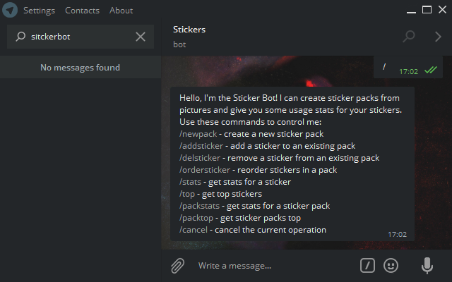

# [Telegram Desktop][telegram_desktop] – Fork of Official Messenger including a dark theme

This is the complete source code and the build instructions for the alpha version of the official desktop client for the [Telegram][telegram] messenger, based on the [Telegram API][telegram_api] and the [MTProto][telegram_proto] secure protocol.

The source code is published under GPLv3 with OpenSSL exception, the license is available [here][license].

## Dark theme

**This fork of Telegram Desktop has a dark theme**

Windows: Binary download can be found under [releases](https://github.com/NXij/tdesktop-dark/releases)
Arch Linux: PKGBUILD on [aur](https://aur.archlinux.org/packages/telegram-desktop-dark-git/)

Co-development and messing-around with [JuanPotato](https://github.com/JuanPotato) and [Melvin V.](https://mel.vin/)

Melvin V. has his own fork of telegram with seperate patches [link to his Gitlab](https://git.mel.vin/melvin/telegram-desktop)

## Supported systems

* Windows XP - Windows 10 (**not** RT)
* Mac OS X 10.8 - Mac OS X 10.11
* Mac OS X 10.6 - Mac OS X 10.7 (separate build)
* Ubuntu 12.04 - Ubuntu 16.04
* Fedora 22

## Third-party libraries

* Qt 5.3.2 and 5.6.0, slightly patched ([LGPL](http://doc.qt.io/qt-5/lgpl.html))
* OpenSSL 1.0.1g ([OpenSSL License](https://www.openssl.org/source/license.html))
* zlib 1.2.8 ([zlib License](http://www.zlib.net/zlib_license.html))
* libexif 0.6.20 ([LGPL](https://www.gnu.org/licenses/old-licenses/lgpl-2.1.en.html))
* LZMA SDK 9.20 ([public domain](http://www.7-zip.org/sdk.html))
* liblzma ([public domain](http://tukaani.org/xz/))
* Google Breakpad ([License](https://chromium.googlesource.com/breakpad/breakpad/+/master/LICENSE))
* Google Crashpad ([Apache License 2.0](https://chromium.googlesource.com/crashpad/crashpad/+/master/LICENSE))
* OpenAL Soft ([LGPL](http://kcat.strangesoft.net/openal.html))
* Opus codec ([BSD license](http://www.opus-codec.org/license/))
* FFmpeg ([LGPL](https://www.ffmpeg.org/legal.html))
* Open Sans font ([Apache License 2.0](http://www.apache.org/licenses/LICENSE-2.0.html))

## Build instructions

* [Visual Studio 2015][msvc]
* [Xcode 7][xcode]
* [Xcode 7 for OS X 10.6 and 10.7][xcode_old]
* [Qt Creator 3.5.1 Ubuntu][qtcreator]
* [Using qmake on GNU/Linux][qmake]

## Projects in Telegram solution

* ### Telegram

  [Telegram Desktop][telegram_desktop] messenger

* ### Updater

  A little app, that is launched by Telegram when update is ready, replaces all files and launches it back.

* ### Packer

  Compiles given files to single update file, compresses it with lzma and signs with a private key. It is not built in **Debug** and **Release** configurations of Telegram solution, because private key is inaccessible.

* ### MetaEmoji

  Creates four sprites and text2emoji replace code
  * SourceFiles/art/emoji.png
  * SourceFiles/art/emoji_125x.png
  * SourceFiles/art/emoji_150x.png
  * SourceFiles/art/emoji_200x.png
  * SourceFiles/art/emoji_250x.png
  * SourceFiles/gui/emoji_config.cpp

* ### codegen_style
* ### codegen_numbers

  Helper code generating console utilities.

* ### MetaLang

  Creates from languagepack file `Resources/lang.strings` language constants code and language file parse code:
  * GeneratedFiles/lang.h
  * GeneratedFiles/lang.cpp

[//]: # (LINKS)
[telegram]: https://telegram.org
[telegram_desktop]: https://desktop.telegram.org
[telegram_api]: https://core.telegram.org
[telegram_proto]: https://core.telegram.org/mtproto
[license]: LICENSE
[msvc]: doc/building-msvc.md
[xcode]: doc/building-xcode.md
[xcode_old]: doc/building-xcode-old.md
[qtcreator]: doc/building-qtcreator.md
[qmake]: doc/building-qmake.md
